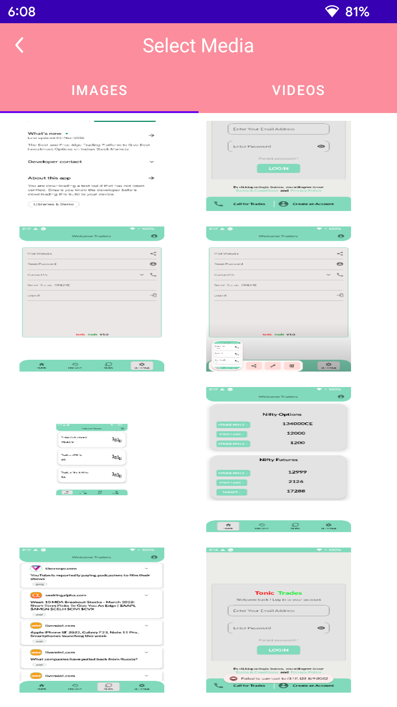
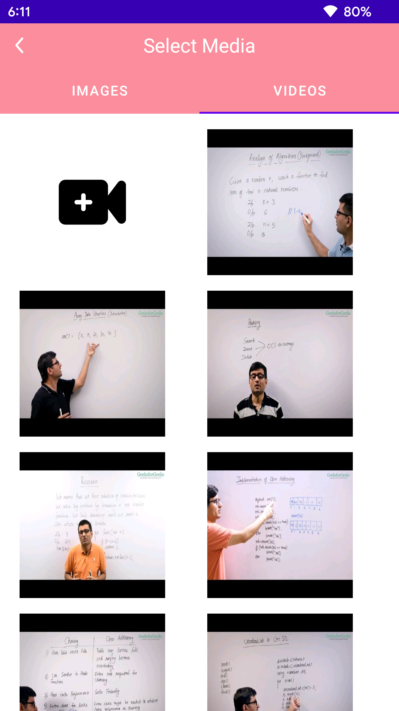
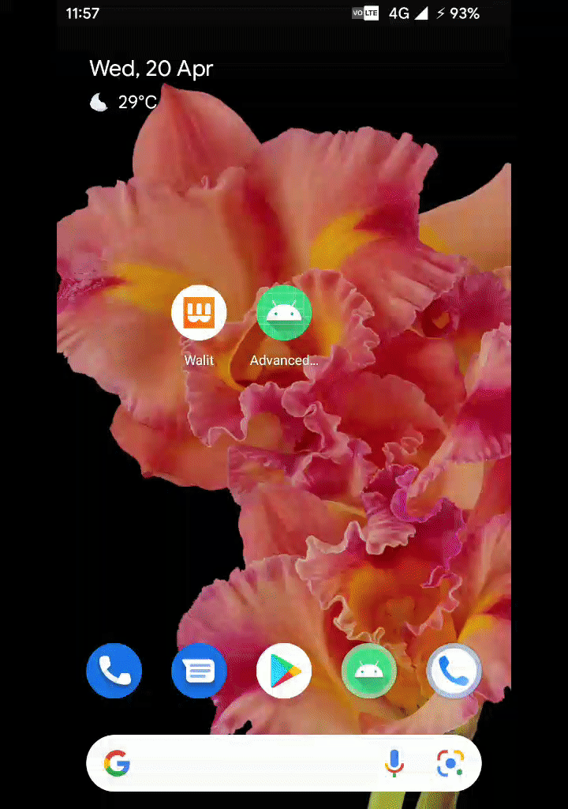

# PickMe
A Simple Android Media Picker Libary Made in Java with Multiple Features.
#### This Libary is under constant Updates. (! ALL_THIS_FOR_4_HEARTS !)

#### Features :

------------

#### Release Notes ::
- 1.0 **Basic Intialzation of the project**
- 2.0 **Pick Media & Preview Media only applied in Activity**
- 2.1 **Pick Media & Preview Media Feature Working in Fragments also. (Implemented Listeners also)**

1.  Make Newly Created Videos And Photos On The Go.
2.  Takes The Context Into The Part And Returns The Uri Of The Image From The Picker Or The Camera And Also, Takes Video From The Camera.

3. Take Media Preview Including Video And Photos Before Finally Picking Them
4.  Works And Tested On Android 12 & Android 10 

**Screenshots of the Libary**

<table>
  <tr>
    <td>Gallery Screen</td>
     <td>Video Screen</td>
     <td>Image Preview Screen</td>
     <td>Video Preview Screen</td>
   </tr>
  <tr>
    <td></td>
    <td></td>
    <td></td>
    <td></td>

  </tr>
 </table>

------------

## Installation

##### Add  The jitpack repository inside the settings.fradle file of your project.

    dependencyResolutionManagement {
                repositoriesMode.set(RepositoriesMode.FAIL_ON_PROJECT_REPOS)
                repositories {
                    google()
                    mavenCentral()
                    jcenter() // Warning: this repository is going to shut down soon
                    maven { url "https://jitpack.io" }
                }
    }

------------

#####  Add the dependency inside the android project 
            implementation 'com.github.RedEyesNCode:PickMe:2.0'

------------
## Using the Libary

- If you want to use this libary in the fragment >> 
1. Implement the RedEyesNCodeListener into the Fragment. Which contains 3 method 

``RedEyesNCodeListener >>  
void onImageReceive(Uri uri);
void onVideoReceive(Uri uri);
void onBitmapReceive(Bitmap bitmap);``

2. Use the ``redEyesNCode.initFragment(getActivity(),this);`` Method if you want to notify the listener

- If you want to use this libary in the activity >>

1. You need to add these check in the onActivityResultOf the Activity from which you are calling.
   ``mediaType can be of Three Types which are :: BITMAP, VIDEO, IMAGE``
2. ``String mediaType = data.getStringExtra("MEDIA_TYPE");``

Note :: Just See the MainActivity.java code you will get it all Trust Me ! :)

